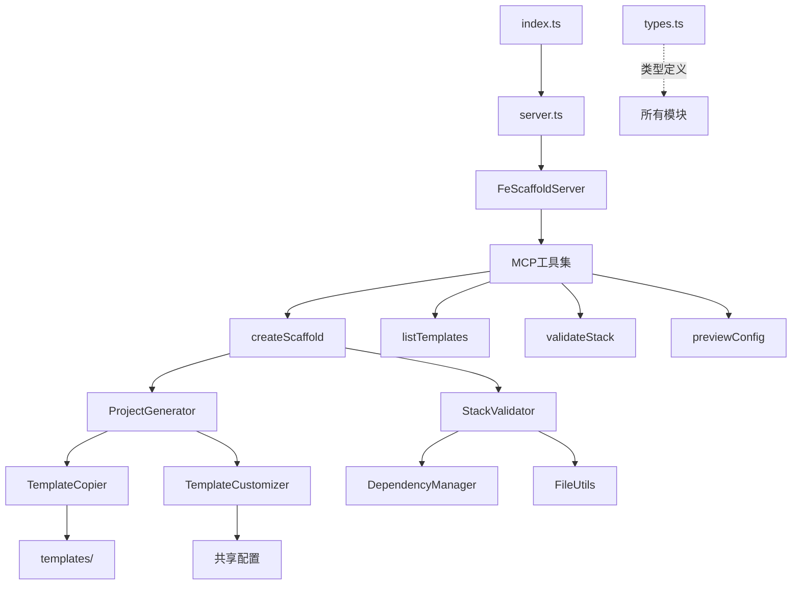

# fe-scaffold-mcp-server 技术文档

## 项目概述

该项目是一个基于Model Context Protocol (MCP)的前端脚手架服务器，用于快速生成各种技术栈的前端项目结构。支持Vue3/Vue2/React框架，集成Vite/Webpack构建工具，提供完整的工程化配置。

## 项目架构图



## 依赖关系树状图

### index.ts (入口文件)
```
index.ts
└── server.ts
    ├── @modelcontextprotocol/sdk/server/index.js (Server)
    ├── @modelcontextprotocol/sdk/server/stdio.js (StdioServerTransport)
    ├── @modelcontextprotocol/sdk/types.js (CallToolRequestSchema, ListToolsRequestSchema)
    ├── tools/createScaffold.js
    │   ├── types.js (ScaffoldOptions, CreateScaffoldParams)
    │   ├── utils/stackValidator.js (StackValidator)
    │   ├── generators/projectGenerator.js (ProjectGenerator)
    │   ├── path (resolve, join, isAbsolute)
    │   └── fs (existsSync)
    ├── tools/listTemplates.js
    │   ├── types.js (StackTemplate, PackageVersion)
    │   └── utils/stackValidator.js (StackValidator)
    ├── tools/validateStack.js
    │   ├── types.js (ValidateStackParams, ScaffoldOptions)
    │   └── utils/stackValidator.js (StackValidator)
    └── tools/previewConfig.js
        ├── types.js (ScaffoldOptions, CreateScaffoldParams)
        ├── utils/stackValidator.js (StackValidator)
        └── utils/dependencyManager.js (DependencyManager)
```

## 核心模块详解

### 1. 服务器模块 (server.ts)

#### 核心类: FeScaffoldServer
- **构造函数 (constructor)**
  - 初始化MCP服务器实例
  - 配置服务器能力和元数据
  - 调用setupToolHandlers()和setupErrorHandling()

- **setupToolHandlers()**
  - 注册工具列表处理器 (ListToolsRequestSchema)
  - 注册工具调用处理器 (CallToolRequestSchema)
  - 分发工具调用到对应的handler函数

- **setupErrorHandling()**
  - 设置错误处理回调
  - 注册进程信号处理 (SIGINT, SIGTERM)
  - 优雅关闭服务器

- **start()**
  - 创建StdioServerTransport传输层
  - 连接服务器到传输层
  - 输出启动日志

### 2. 工具模块 (tools/)

#### createScaffold.ts
**核心函数:**
- **handleCreateScaffold(params: CreateScaffoldParams)**
  - 构建脚手架选项
  - 验证技术栈兼容性
  - 生成项目文件
  - 返回创建结果报告

- **buildScaffoldOptions(params: CreateScaffoldParams)**
  - 解析用户参数
  - 设置默认值
  - 构建完整的ScaffoldOptions对象

- **resolveProjectPathAndName(params, options)**
  - 解析项目路径和名称
  - 处理绝对路径和相对路径
  - 查找有效工作空间

#### listTemplates.ts
**核心函数:**
- **handleListTemplates(params)**
  - 获取预定义模板列表
  - 根据参数筛选模板
  - 格式化输出模板信息

- **getTemplateById(id: string)**
  - 根据ID获取特定模板

- **getAllTemplates()**
  - 获取所有可用模板

#### validateStack.ts
**核心函数:**
- **handleValidateStack(params)**
  - 验证技术栈组合
  - 生成验证报告
  - 提供修复建议

- **buildOptionsFromParams(params)**
  - 从参数构建ScaffoldOptions
  - 设置默认值和推荐配置

- **getBestPractices(options)**
  - 基于配置生成最佳实践建议

- **calculateCompatibilityScore(validation)**
  - 计算兼容性评分
  - 基于错误和警告数量计算

#### previewConfig.ts
**核心函数:**
- **handlePreviewConfig(params)**
  - 预览项目配置
  - 显示依赖信息
  - 生成项目结构预览

- **generateProjectStructure(options, projectName)**
  - 生成项目目录结构图
  - 基于技术栈选择文件扩展名

### 3. 工具类模块 (utils/)

#### stackValidator.ts
**核心类: StackValidator**
- **validate(options: ScaffoldOptions)**
  - 验证框架和构建工具兼容性
  - 验证UI组件库兼容性
  - 验证测试框架兼容性
  - 验证Mock方案兼容性

- **getRecommendations(framework: string)**
  - 基于框架返回推荐配置
  - 预定义最佳实践组合

- **autoFix(options: ScaffoldOptions)**
  - 自动修复不兼容的配置
  - 返回修复后的配置对象

#### dependencyManager.ts
**核心类: DependencyManager**
- **getDependencies(options: ScaffoldOptions)**
  - 基于配置生成依赖列表
  - 分离生产依赖和开发依赖
  - 处理框架、构建工具、样式方案等依赖

- **generateScripts(options: ScaffoldOptions)**
  - 生成package.json中的scripts字段
  - 基于构建工具和测试框架生成命令

#### fileUtils.ts
**核心类: FileUtils**
- **ensureDir(dirPath: string)**
  - 确保目录存在，如不存在则创建

- **writeFile(filePath: string, content: string)**
  - 写入文件，自动创建父目录

- **writeFiles(outputDir: string, files: GeneratedFile[])**
  - 批量写入文件
  - 返回成功和失败的文件列表

### 4. 生成器模块 (generators/)

#### projectGenerator.ts
**核心类: ProjectGenerator**
- **generateProject(options, projectName, outputPath)**
  - 主要项目生成入口
  - 协调模板复制和定制过程
  - 返回生成结果统计

- **generateProjectStats(successFiles: string[])**
  - 生成项目统计信息
  - 分析文件类型分布

- **validateProject(projectPath, options)**
  - 验证生成的项目完整性
  - 检查必需文件是否存在

#### templateCopier.ts
**核心类: TemplateCopier**
- **copyTemplate(options, targetPath)**
  - 复制基础模板文件
  - 处理模板路径解析
  - 递归复制目录结构

- **copySharedConfigs(options, targetPath)**
  - 复制共享配置文件
  - 基于选项选择合适的配置

- **getConfigFilesForFramework(options)**
  - 根据框架选择配置文件
  - 处理ESLint、样式框架、测试等配置

#### templateCustomizer.ts
**核心类: TemplateCustomizer**
- **customizeTemplate(targetPath, options, projectName)**
  - 定制模板文件
  - 替换占位符
  - 添加可选文件

- **customizePackageJson(targetPath, options, projectName)**
  - 定制package.json文件
  - 合并依赖和脚本

- **replacePlaceholders(targetPath, options, projectName)**
  - 在文件中替换模板占位符
  - 递归处理目录中的所有文本文件

### 5. 类型定义 (types.ts)

**主要接口和类型:**
- **ScaffoldOptions**: 脚手架配置选项
- **CreateScaffoldParams**: 创建脚手架参数
- **ValidateStackParams**: 验证技术栈参数
- **DependencyInfo**: 依赖包信息
- **StackTemplate**: 技术栈模板
- **GeneratedFile**: 生成的文件信息

## 技术方案讲解

### 1. 架构设计原则

#### 模块化设计
- **单一职责**: 每个模块负责特定功能领域
- **依赖注入**: 通过类型系统管理模块间依赖
- **接口隔离**: 定义清晰的接口边界

#### MCP协议集成
- **工具注册**: 通过MCP协议注册可用工具
- **参数验证**: 使用JSON Schema验证工具参数
- **错误处理**: 统一的错误处理和响应格式

### 2. 核心算法

#### 技术栈验证算法
```typescript
function validate(options: ScaffoldOptions) {
  const errors = [];
  const warnings = [];
  
  // 1. 框架兼容性检查
  validateFrameworkCompatibility(options, errors, warnings);
  
  // 2. UI组件库兼容性检查
  validateUILibraryCompatibility(options, errors, warnings);
  
  // 3. 工具链兼容性检查
  validateToolchainCompatibility(options, errors, warnings);
  
  return { isValid: errors.length === 0, errors, warnings };
}
```

#### 依赖解析算法
```typescript
function getDependencies(options: ScaffoldOptions) {
  const dependencies = [];
  const devDependencies = [];
  
  // 1. 基础框架依赖
  addFrameworkDependencies(options.framework, dependencies, devDependencies);
  
  // 2. 构建工具依赖
  addBuildToolDependencies(options.buildTool, devDependencies);
  
  // 3. 功能特性依赖
  addFeatureDependencies(options.qualityTools, devDependencies);
  
  return { dependencies, devDependencies };
}
```

### 3. 模板系统

#### 模板结构
```
templates/
├── vue3-vite/          # Vue3 + Vite模板
├── vue2-webpack/       # Vue2 + Webpack模板
├── react-vite/         # React + Vite模板
└── shared/             # 共享配置文件
    ├── configs/        # 配置文件模板
    └── test-examples/  # 测试示例
```

#### 模板处理流程
1. **模板选择**: 根据framework + buildTool组合选择基础模板
2. **文件复制**: 复制基础模板文件到目标目录
3. **配置注入**: 根据选项复制相应的配置文件
4. **占位符替换**: 替换模板中的动态内容
5. **依赖管理**: 更新package.json中的依赖和脚本

### 4. 错误处理策略

#### 分层错误处理
- **工具层**: 捕获工具执行错误，返回格式化错误信息
- **服务层**: 统一错误格式，记录错误日志
- **传输层**: MCP协议级别的错误响应

#### 容错机制
- **部分失败处理**: 文件写入失败时继续处理其他文件
- **配置自动修复**: 检测到不兼容配置时自动调整
- **默认值回退**: 缺少必要参数时使用合理默认值

### 5. 性能优化

#### 并发处理
- **并行文件操作**: 同时进行多个文件的读写操作
- **模板缓存**: 缓存已解析的模板内容
- **增量验证**: 仅验证变更的配置选项

#### 内存管理
- **流式处理**: 大文件使用流式读写避免内存溢出
- **及时释放**: 处理完成后及时释放资源引用
- **对象池**: 复用常用对象减少GC压力

## 扩展指南

### 1. 添加新框架支持

1. 在`templates/`目录添加新框架模板
2. 更新`types.ts`中的框架枚举
3. 在`DependencyManager`中添加框架依赖配置
4. 在`StackValidator`中添加兼容性规则

### 2. 添加新工具

1. 在`tools/`目录创建新工具文件
2. 实现工具定义和处理函数
3. 在`server.ts`中注册新工具
4. 更新文档和测试用例

### 3. 自定义模板

1. 创建模板目录结构
2. 使用`_`前缀标记模板文件
3. 添加占位符支持动态内容
4. 在`TemplateCopier`中注册模板

## 总结

fe-scaffold-mcp-server采用了模块化、可扩展的架构设计，通过MCP协议提供标准化的工具接口。核心包含了完整的前端项目脚手架生成能力，支持多种技术栈组合，提供了灵活的配置选项和强大的验证机制。整个系统具有良好的可维护性和扩展性，为前端项目的快速启动提供了强有力的支持。